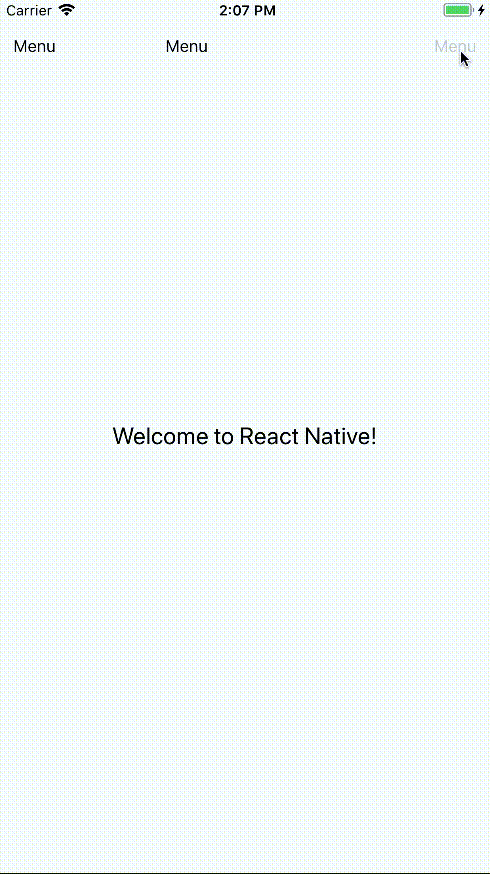

[](https://www.npmjs.com/package/react-native-pop-menu)

## react-native-pop-menu

A popup menu component for Android and iOS.



### Installation

```
$ npm install react-native-pop-menu --save
```

### Demo

```
$cd demo
```

```
$npm install
```

```
$react-native run-ios
```

### Basic Usage

```
  render() {
    return (
      <View style={styles.container}>
        <TouchableOpacity style={{ position: 'absolute', right: 12, top: 32 }}
                          onPress={() => {
                            this.setState({
                              menuVisible: true
                            });
                          }}>
          <Text>Menu</Text>
        </TouchableOpacity>
        <Menu visible={this.state.menuVisible}
              onVisible={(isVisible) => {
                this.state.menuVisible = isVisible
              }} 
              data={[
                {
                  title: 'MenuItem 1',
                  onPress: () => {
                    //todo something...
                  }
                },
                {
                  title: 'MenuItem 2',
                  onPress: () => {
                    //todo something...
                  }
                },
              ]} />
      </View>
    );
  }
```

### API

Props:

|prop|type|description|default|
|-----|-----|-----|-----|
|data|Array|Array that include object which contain 'title' and 'onPress'|undefined|
|top|Number|Menu top position|74|
|right|Number|Menu right position|If not set 'top' and 'right', right = 12|
|left|Number|Menu left position|If not set 'top' and 'right', right = 12|
|visible|Bool|Determines whether your Menu is visible|true|
|onVisible|Function|The 'onVisible' callback is called when the Menu's visible changed|undefined|
|arrowPosition|String|Menu arrow's position, one of 'topRight', 'topLeft', 'topCenter'|'topRight'|
|contentStyle|View.propTypes.style|Edit the Menu's style|{ backgroundColor: defaultColor }|

